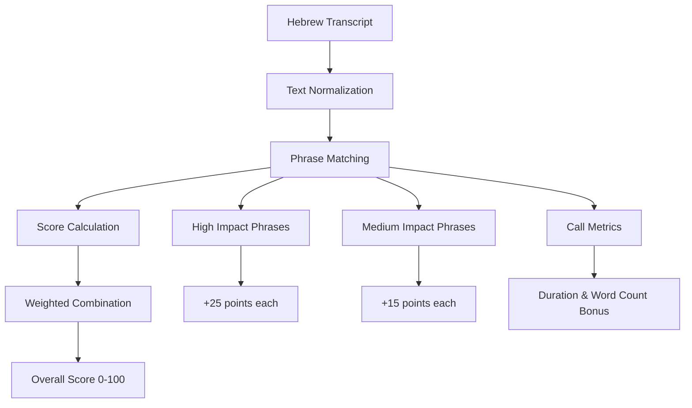
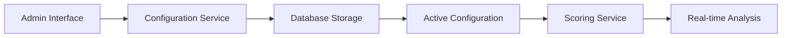

# Hebrew Sales Call Analysis - Scoring Algorithm Deep Dive

## 🎯 Overview: How the Scoring Algorithm Works

The scoring algorithm is like having a smart assistant that listens to Hebrew sales calls and tells you which customers are most likely to buy. Think of it as a **customer potential detector** that analyzes what people say and how they say it.

### The Big Picture
```
Audio File → Hebrew Transcription → Smart Analysis → Customer Score (0-100)
```

## 🧠 The Four-Pillar Scoring System

The algorithm looks at **four key factors** that indicate whether someone is likely to buy:

### 1. 🚨 **Urgency (30% weight)**
**Question**: "How soon does this person need to buy?"

**What it looks for**:
- Time pressure indicators
- Deadlines and constraints
- Family pressure to buy
- Rental agreements ending

**Why it matters**: People under time pressure are more likely to make quick decisions.

### 2. 💰 **Budget (25% weight)**
**Question**: "Can this person afford to buy?"

**What it looks for**:
- Specific budget amounts
- Approved mortgages
- Cash availability
- Financial readiness signals

**Why it matters**: People with clear budgets and financing are more likely to complete purchases.

### 3. 🎯 **Interest (25% weight)**
**Question**: "How interested is this person in the property?"

**What it looks for**:
- Positive reactions to property details
- Questions about viewing the property
- Expressions of liking the location
- Requests for more information

**Why it matters**: Genuine interest is a strong predictor of purchase intent.

### 4. 💬 **Engagement (20% weight)**
**Question**: "How actively is this person participating in the conversation?"

**What it looks for**:
- Asking questions
- Requesting more details
- Active participation
- Call duration and word count

**Why it matters**: Engaged customers are more likely to move forward in the sales process.

## 📊 How Scores Are Calculated

### Step-by-Step Process



### Detailed Scoring Logic

#### **Individual Category Scoring**

Each category (Urgency, Budget, Interest, Engagement) is scored from 0-100:

1. **High-Impact Phrases**: +25 points each
2. **Medium-Impact Phrases**: +15 points each
3. **Multiple Match Bonus**: +20 points for 2+ high matches, +10 for 2+ medium matches
4. **Call Metrics Bonus** (for Engagement only):
   - Duration: 5+ min (+25), 3+ min (+20), 2+ min (+15), 1+ min (+10)
   - Word Count: 150+ words (+20), 100+ (+15), 50+ (+10), 25+ (+5)

#### **Overall Score Calculation**

```
Overall Score = (Urgency × 0.30) + (Budget × 0.25) + (Interest × 0.25) + (Engagement × 0.20)
```

**Example**:
- Urgency: 80 points → 80 × 0.30 = 24
- Budget: 70 points → 70 × 0.25 = 17.5
- Interest: 90 points → 90 × 0.25 = 22.5
- Engagement: 85 points → 85 × 0.20 = 17
- **Overall Score**: 24 + 17.5 + 22.5 + 17 = **81 points**

## 🔧 What's Configurable (And Why)

### 1. **Scoring Weights** ⚖️
**What**: The importance of each category (currently 30%, 25%, 25%, 20%)

**Why Configurable**: Different sales teams may prioritize different factors:
- **High-end properties**: Might want higher Budget weight
- **New developments**: Might want higher Urgency weight
- **Luxury market**: Might want higher Interest weight

**How to Adjust**: Through the Configuration panel in the admin interface

### 2. **Hebrew Phrases** 📝
**What**: The specific words and phrases that trigger scoring

**Why Configurable**: 
- **Regional variations**: Different Hebrew dialects
- **Market evolution**: New phrases emerge over time
- **Property types**: Different phrases for apartments vs. houses
- **Cultural context**: Local expressions and idioms

**Categories**:
- **High-Impact Phrases**: Strong indicators (+25 points)
- **Medium-Impact Phrases**: Moderate indicators (+15 points)

### 3. **Scoring Thresholds** 🎯
**What**: The point values for different phrase types and bonuses

**Why Configurable**:
- **Market sensitivity**: Some markets need more/less sensitivity
- **A/B testing**: Compare different scoring approaches
- **Seasonal adjustments**: Different weights for different times of year

### 4. **Objection Detection** 🚫
**What**: Phrases that indicate hesitation or resistance

**Why Configurable**:
- **Market-specific objections**: Different concerns in different areas
- **Property-specific objections**: Different issues for different property types
- **Cultural objections**: Local concerns and preferences

## 🎨 How Hebrew Phrases Are Chosen

### The Selection Process

#### 1. **Market Research** 📊
- **Real estate professionals**: Interviews with successful agents
- **Sales call analysis**: Review of actual successful/failed calls
- **Cultural context**: Understanding Israeli real estate market
- **Linguistic analysis**: Hebrew language patterns and expressions

#### 2. **Phrase Categories** 📋

**High-Impact Phrases** (Strong signals):
- Specific and direct expressions
- Clear intent indicators
- Time-sensitive language
- Financial commitment signals

**Medium-Impact Phrases** (Moderate signals):
- General interest expressions
- Exploratory language
- Soft commitment indicators
- Information-seeking behavior

#### 3. **Cultural Considerations** 🌍
- **Israeli directness**: Hebrew speakers tend to be more direct
- **Family influence**: Family pressure is common in Israeli culture
- **Financial transparency**: Israelis often discuss budgets openly
- **Time sensitivity**: Israeli market moves quickly

### Example Phrase Selection

#### **Urgency Phrases**
```javascript
// High Impact (25 points each)
'אני צריך לעבור עד החודש הבא'  // "I need to move by next month"
'זה דחוף מאוד'                 // "This is very urgent"
'השכירות שלי נגמרת בעוד חודש'  // "My lease ends in a month"

// Medium Impact (15 points each)
'אני רוצה לעבור'               // "I want to move"
'אני מחפש'                     // "I'm looking"
```

#### **Budget Phrases**
```javascript
// High Impact (25 points each)
'התקציב שלי הוא'               // "My budget is"
'משכנתא מאושרת'                // "Approved mortgage"
'אלף שקל'                      // "Thousand shekels"

// Medium Impact (15 points each)
'אני יכול לשלם'                // "I can pay"
'תקציב של'                     // "Budget of"
```

## 🔄 How Configuration Works

### Dynamic Configuration System

The system uses a **database-driven configuration** that can be changed without restarting the application:



### Configuration Management Features

#### 1. **Multiple Configurations** 📚
- Create different configurations for different scenarios
- A/B test different approaches
- Seasonal configurations
- Market-specific configurations

#### 2. **Version Control** 📝
- Track configuration changes over time
- Rollback to previous versions
- Compare different configurations
- Export/import configurations

#### 3. **Validation** ✅
- Ensure weights sum to 100%
- Validate phrase formats
- Check for duplicate phrases
- Prevent invalid configurations

### Example Configuration Structure

```json
{
  "name": "High-End Market Configuration",
  "weights": {
    "urgency": 0.25,    // Lower urgency for luxury market
    "budget": 0.35,     // Higher budget importance
    "interest": 0.25,   // Same interest weight
    "engagement": 0.15  // Lower engagement weight
  },
  "phrases": {
    "urgency": {
      "high": [
        "אני צריך לעבור עד החודש הבא",
        "זה דחוף מאוד"
      ],
      "medium": [
        "אני רוצה לעבור",
        "אני מחפש"
      ]
    },
    "budget": {
      "high": [
        "התקציב שלי הוא",
        "משכנתא מאושרת",
        "הון עצמי"
      ],
      "medium": [
        "אני יכול לשלם",
        "תקציב של"
      ]
    }
  }
}
```

## 🎯 Score Interpretation

### Score Ranges and Meanings

#### **Overall Score Breakdown**

| Score Range | Category | Meaning | Action Required |
|-------------|----------|---------|-----------------|
| 85-100 | 🟢 **Excellent** | High potential customer | Immediate follow-up |
| 75-84 | 🟡 **Very Good** | Strong potential | Priority follow-up |
| 60-74 | 🟠 **Good** | Good potential | Regular follow-up |
| 45-59 | 🟤 **Fair** | Moderate potential | Additional nurturing |
| 30-44 | 🔴 **Poor** | Low potential | Minimal effort |
| 0-29 | ⚫ **Very Poor** | Very low potential | Consider dropping |

#### **Individual Category Interpretation**

**Urgency Scores**:
- 80-100: Very urgent, immediate action needed
- 60-79: Some urgency, prioritize follow-up
- 40-59: Moderate urgency, regular follow-up
- 0-39: No urgency, can take time

**Budget Scores**:
- 80-100: Clear budget, ready to buy
- 60-79: Some budget clarity, needs discussion
- 40-59: Unclear budget, needs exploration
- 0-39: No budget discussion, needs qualification

**Interest Scores**:
- 80-100: Very interested, ready to view
- 60-79: Interested, needs nurturing
- 40-59: Some interest, needs development
- 0-39: Low interest, needs motivation

**Engagement Scores**:
- 80-100: Highly engaged, active participant
- 60-79: Engaged, good participation
- 40-59: Some engagement, needs encouragement
- 0-39: Low engagement, needs different approach

## 🔍 Advanced Features

### 1. **Confidence Scoring** 🎯
The system calculates how confident it is in its analysis:

**Factors**:
- **Word count**: More words = higher confidence
- **Phrase matches**: More matches = higher confidence
- **Call duration**: Longer calls = higher confidence

**Confidence Levels**:
- 90-100%: Very confident
- 70-89%: Confident
- 50-69%: Moderately confident
- 30-49%: Low confidence
- 0-29%: Very low confidence

### 2. **Objection Detection** 🚫
Identifies phrases that indicate hesitation:

**Common Objections**:
- "זה יקר מדי" (It's too expensive)
- "אני צריך לחשוב" (I need to think)
- "אני אחזור אליך" (I'll get back to you)
- "יש לי עוד אפשרויות" (I have other options)

### 3. **Analysis Notes** 📝
Generates detailed Hebrew analysis notes explaining:
- Overall assessment
- Category-specific insights
- Recommended actions
- Risk factors
- Opportunities

## 🚀 Continuous Improvement

### How the System Learns

#### 1. **Performance Tracking** 📊
- Track which high-scoring customers actually buy
- Monitor which low-scoring customers convert
- Analyze false positives and false negatives
- Measure prediction accuracy over time

#### 2. **Phrase Optimization** 🔧
- Add new phrases based on successful calls
- Remove phrases that don't correlate with sales
- Adjust phrase weights based on performance
- Regional phrase variations

#### 3. **Weight Adjustment** ⚖️
- Analyze which categories are most predictive
- Adjust weights based on market performance
- Seasonal weight adjustments
- Property type-specific weights

### A/B Testing Framework

The system supports testing different configurations:

```javascript
// Example A/B Test Configuration
{
  "testName": "Urgency Weight Test",
  "variantA": {
    "weights": { "urgency": 0.30, "budget": 0.25, "interest": 0.25, "engagement": 0.20 }
  },
  "variantB": {
    "weights": { "urgency": 0.35, "budget": 0.20, "interest": 0.25, "engagement": 0.20 }
  },
  "duration": "30 days",
  "successMetric": "conversion_rate"
}
```

## 🎯 Best Practices for Configuration

### 1. **Start with Defaults** 🏁
- Use the default configuration as a baseline
- Test with real calls before making changes
- Document any changes and their rationale

### 2. **Make Incremental Changes** 📈
- Change one thing at a time
- Test changes with a subset of calls
- Monitor performance before full deployment
- Rollback if performance degrades

### 3. **Consider Market Context** 🌍
- Different markets have different dynamics
- Seasonal factors affect urgency
- Property types influence interest patterns
- Cultural factors impact engagement

### 4. **Regular Review** 📅
- Monthly performance review
- Quarterly configuration optimization
- Annual comprehensive analysis
- Continuous monitoring and adjustment

## 🔮 Future Enhancements

### Planned Improvements

#### 1. **Machine Learning Integration** 🤖
- Automatic phrase discovery
- Dynamic weight adjustment
- Predictive modeling
- Pattern recognition

#### 2. **Advanced Analytics** 📊
- Conversion rate prediction
- Customer lifetime value scoring
- Market trend analysis
- Competitive intelligence

#### 3. **Multi-Language Support** 🌐
- Arabic language support
- English language support
- Automatic language detection
- Cross-language analysis

#### 4. **Real-Time Learning** ⚡
- Live configuration updates
- Instant performance feedback
- Adaptive scoring algorithms
- Continuous optimization

---

## 📋 Summary

The Hebrew Sales Call Analysis scoring algorithm is a sophisticated yet user-friendly system that:

1. **Analyzes four key factors** that predict purchase likelihood
2. **Uses Hebrew-specific phrases** chosen through market research
3. **Provides configurable weights and phrases** for different scenarios
4. **Generates detailed insights** in Hebrew for sales teams
5. **Continuously improves** through performance tracking and optimization

The system is designed to be **transparent, adjustable, and effective** - giving sales teams the insights they need to prioritize their efforts and close more deals.

**Key Takeaway**: This isn't just a scoring system; it's a **sales intelligence platform** that learns and adapts to help you sell more effectively in the Israeli real estate market.
