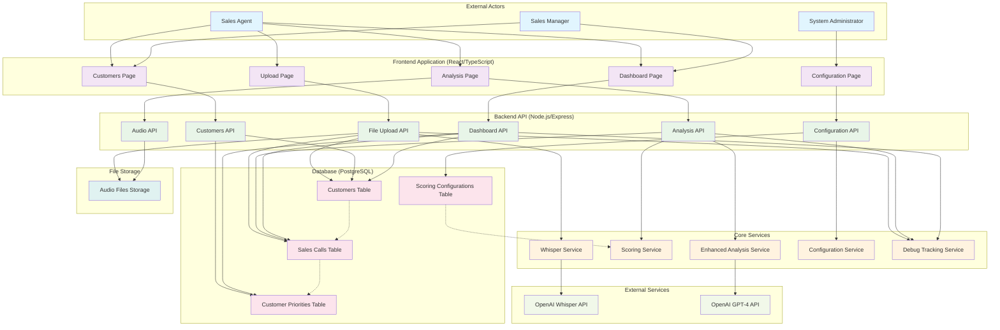
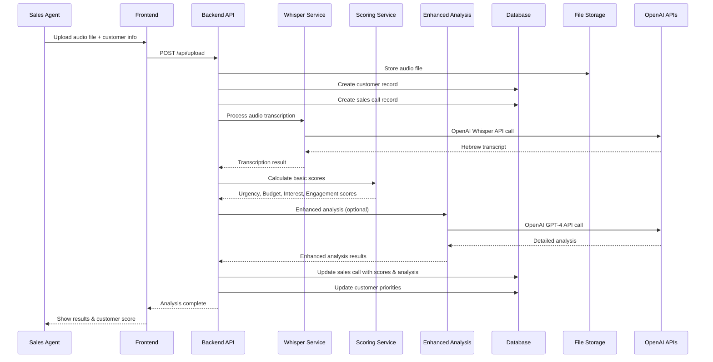
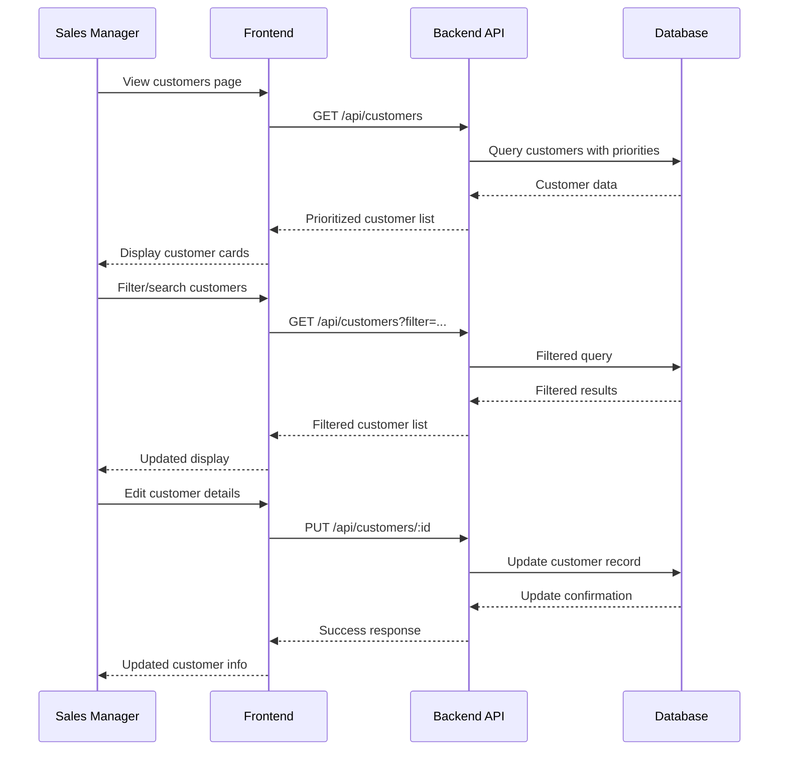
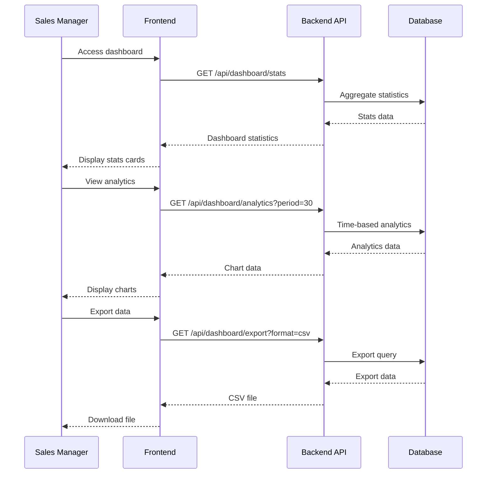
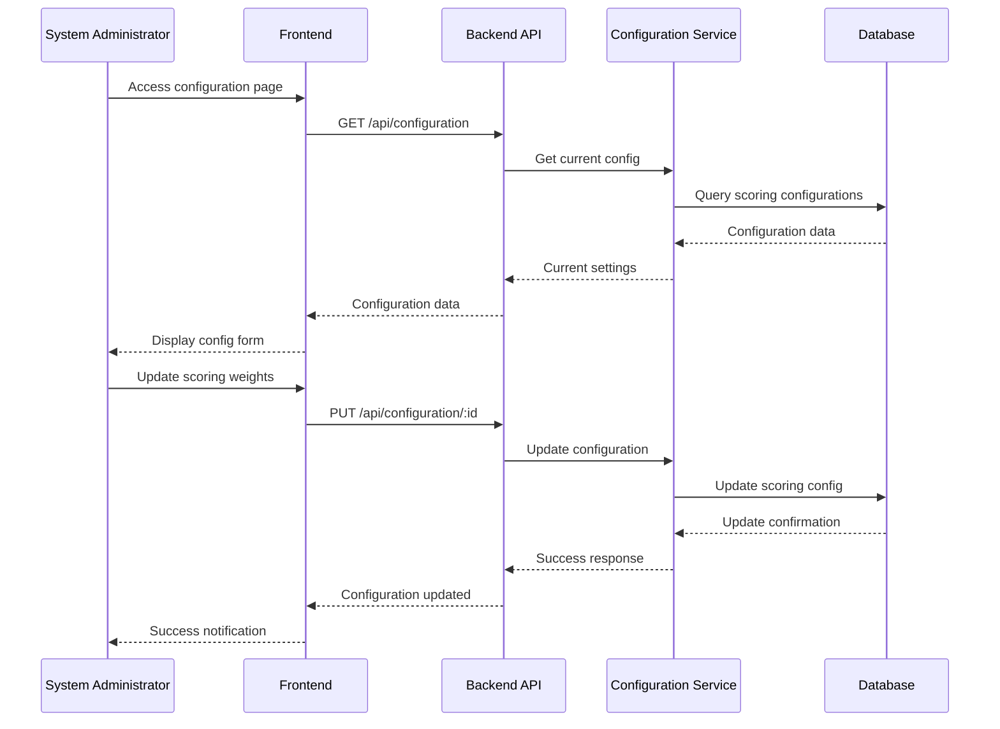
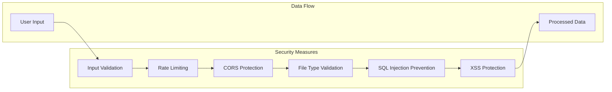
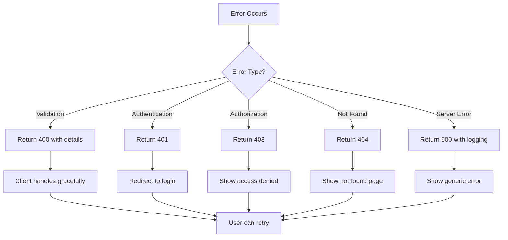

# Hebrew Sales Call Analysis System - System Flow Diagram

## System Overview Flow



## Detailed Process Flow

### 1. File Upload & Analysis Flow



### 2. Customer Management Flow



### 3. Dashboard Analytics Flow



### 4. Configuration Management Flow



## System Architecture Layers

### Layer 1: Presentation Layer (Frontend)
- **Technology**: React 19+ with TypeScript
- **Components**: Dashboard, Upload, Customers, Analysis, Configuration
- **State Management**: TanStack React Query
- **UI Framework**: Tailwind CSS

### Layer 2: API Gateway Layer (Backend)
- **Technology**: Node.js with Express.js
- **Responsibilities**: Request routing, validation, authentication
- **Endpoints**: RESTful API with proper error handling

### Layer 3: Business Logic Layer (Services)
- **Whisper Service**: Hebrew audio transcription
- **Scoring Service**: Multi-factor customer analysis
- **Enhanced Analysis Service**: GPT-4 powered insights
- **Configuration Service**: Dynamic system configuration
- **Debug Tracking Service**: Development support

### Layer 4: Data Access Layer
- **Database**: PostgreSQL with Prisma ORM
- **File Storage**: Local storage (S3-ready)
- **External APIs**: OpenAI Whisper & GPT-4

## Key Data Flows

### 1. Audio Processing Pipeline
```
Audio File → Validation → Storage → Transcription → Analysis → Scoring → Database
```

### 2. Customer Prioritization Pipeline
```
Sales Calls → Score Aggregation → Priority Calculation → Ranking → Dashboard
```

### 3. Configuration Update Pipeline
```
Admin Input → Validation → Database Update → Service Reload → Active Configuration
```

## System Boundaries

### Input Boundaries
- **Audio Files**: MP3, WAV, M4A, AAC, OGG (max 10MB)
- **Customer Data**: Name, phone, email
- **Configuration**: Scoring weights, Hebrew phrases

### Output Boundaries
- **Customer Scores**: 0-100 scale with breakdown
- **Prioritization**: Ranked customer list
- **Analytics**: Performance metrics and trends
- **Reports**: Exportable data formats

### External Dependencies
- **OpenAI Whisper API**: Audio transcription
- **OpenAI GPT-4 API**: Enhanced analysis
- **PostgreSQL Database**: Data persistence
- **File Storage**: Audio file management

## Performance Characteristics

### Processing Times
- **Audio Upload**: 1-5 seconds (depending on file size)
- **Transcription**: 30-120 seconds (depending on audio length)
- **Basic Scoring**: 1-3 seconds
- **Enhanced Analysis**: 10-30 seconds
- **Dashboard Loading**: 1-2 seconds

### Scalability Considerations
- **Horizontal Scaling**: Load balancer ready
- **Database**: Connection pooling, proper indexing
- **File Storage**: S3 migration path
- **Caching**: Redis integration planned

## Security Flow



## Error Handling Flow



---

*This flow diagram provides a comprehensive view of the Hebrew Sales Call Analysis System, showing all actors, processes, and data flows from initial file upload through final analysis and reporting. The system is designed to be scalable, secure, and user-friendly for real estate sales professionals in Israel.*
